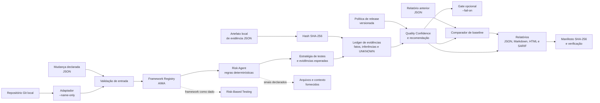

# Arquitetura

O MVP implementa uma fatia vertical, não uma plataforma completa. O CLI coordena módulos determinísticos: entrada declarada ou adaptador de diff local, registry, risco, estratégia e relatório.

## Visão de execução

O adaptador de Git lê somente a lista local de arquivos alterados entre referências. O diagrama não implica leitura de conteúdo de diff, pull request remoto, uso de LLM, execução de testes externos ou publicação automática de comentários.

## Decisões

| Decisão | Motivo | Limite atual |
| --- | --- | --- |
| Node.js sem dependências | Execução simples e reprodutível | Não há parser YAML completo; os arquivos usam subconjunto JSON compatível. |
| Framework Registry | Evita hardcode de metodologias AIMA | Só há um framework inicial. |
| Sinais de risco explícitos | Evita alegações de análise mágica ou leitura remota | Não substitui análise de diff real. |
| Quality Confidence explicável | Mostra trade-offs e incertezas | Métrica experimental, não preditiva. |
| Ledger de evidências | Torna origem e tipo de cada afirmação auditáveis | Ainda não referencia execução de testes externa. |
| Política de release | Separa governança de decisão e código | Exige contexto humano para impacto e complexidade. |
| Comparação com baseline | Destaca mudanças entre análises declaradas | Não demonstra regressão de código. |
| Artefato com SHA-256 | Registra integridade do arquivo local analisado | Não comprova resultado de teste. |
| Gate opcional de CI | Converte recomendação em código de saída | Padrão não bloqueia pipelines. |
| Manifesto de relatório | Permite verificar integridade dos artefatos gerados | Não comprova veracidade da entrada. |

O próximo adaptador deve implementar leitura autorizada de um diff real antes de adicionar novos agentes ou LLMs.

## Contratos e rastreabilidade

| Elemento | Contrato atual | Referência |
| --- | --- | --- |
| Entrada | Mudança declarada, validada antes da análise | [`aima/schemas/change-input.schema.json`](aima/schemas/change-input.schema.json) |
| Framework | Dados versionados, escolhidos pelo registry | [`aima/frameworks`](aima/frameworks) |
| Decisão | Fatos, inferências e incertezas separados | [`docs/QUALITY_DECISION_MODEL.md`](docs/QUALITY_DECISION_MODEL.md) |
| Evolução | Decisões irreversíveis ou relevantes são registradas | [`docs/adr`](docs/adr) |

## Documentação viva

Documentação e código evoluem no mesmo pull request. Uma alteração de comportamento precisa atualizar, quando aplicável, o contrato de entrada, os testes, o exemplo, o diagrama e o changelog. A convenção detalhada está em [`docs/DOCUMENTATION.md`](docs/DOCUMENTATION.md).
