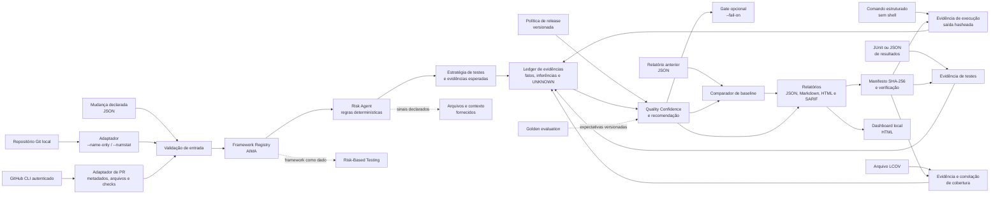

# Arquitetura

O projeto concluiu três fatias verticais (MVP 0 a MVP 2), sem se apresentar como plataforma completa. O CLI coordena módulos determinísticos para entrada declarada, diff Git local ou PR autorizado; coleta evidências locais explícitas; aplica registry, risco e estratégia; e gera relatórios auditáveis.

## Visão de execução

O adaptador de Git lê a lista local de arquivos alterados e, opcionalmente, estatísticas de linhas entre referências. O adaptador de PR usa o GitHub CLI autenticado apenas para metadados, nomes de arquivos e checks disponíveis. O diagrama não implica leitura de conteúdo de diff, uso de LLM, execução automática de comandos não declarados ou publicação automática de comentários.

## Decisões

| Decisão | Motivo | Limite atual |
| --- | --- | --- |
| Node.js sem dependências | Execução simples e reprodutível | Não há parser YAML completo; os arquivos usam subconjunto JSON compatível. |
| Framework Registry | Evita hardcode de metodologias AIMA e seleciona pela superfície declarada | A seleção atual usa sinais de caminho simples. |
| Sinais de risco explícitos | Evita alegações de análise mágica ou leitura remota | Não substitui análise de diff real. |
| Quality Confidence explicável | Mostra trade-offs e incertezas | Métrica experimental, não preditiva. |
| Ledger de evidências | Torna origem e tipo de cada afirmação auditáveis | Registra resultado e hash; não prova que o ambiente externo representa produção. |
| Política de release | Separa governança de decisão e código | Exige contexto humano para impacto e complexidade. |
| Comparação com baseline | Destaca mudanças entre análises declaradas | Não demonstra regressão de código. |
| Evidência estruturada com SHA-256 | Registra integridade de comandos, artefatos e transcripts locais | Não comprova que a execução representa produção. |
| Importadores JUnit, JSON e LCOV | Reúne resultados e cobertura sem logs sensíveis | Parsers deliberadamente limitados aos contratos documentados. |
| Manifesto de evidências | Reproduz uma análise com entradas explícitas | Não descobre nem executa ferramentas automaticamente. |
| Gate opcional de CI | Converte recomendação em código de saída | Padrão não bloqueia pipelines. |
| Manifesto de relatório | Permite verificar integridade dos artefatos gerados | Não comprova veracidade da entrada. |
| Avaliação golden | Detecta regressão em decisões determinísticas | Cobertura limitada aos cenários versionados. |
| Dashboard local | Agrega relatórios para leitura visual | Não persiste dados nem consulta remoto. |
| Adaptador MCP isolado ([`integrations/mcp`](integrations/mcp)) | Expõe o core a clientes MCP sem acoplar o pacote raiz ao SDK | Somente leitura: resources do registry e a tool `analyze_change`, todos sob `assertOperationPermitted`. Ver [ADR 0002](docs/adr/0002-adaptador-mcp-stdio-isolado.md). |

O próximo marco é uma interface interativa e governança de permissões. Qualquer nova integração deve manter leitura mínima, escrita sempre autorizada e incertezas explícitas.

## Contratos e rastreabilidade

| Elemento | Contrato atual | Referência |
| --- | --- | --- |
| Entrada | Mudança declarada, validada antes da análise | [`aima/schemas/change-input.schema.json`](aima/schemas/change-input.schema.json) |
| Framework | Dados versionados, escolhidos pelo registry | [`aima/frameworks`](aima/frameworks) |
| Decisão | Fatos, inferências e incertezas separados | [`docs/QUALITY_DECISION_MODEL.md`](docs/QUALITY_DECISION_MODEL.md) |
| Evolução | Decisões irreversíveis ou relevantes são registradas | [`docs/adr`](docs/adr) |

## Documentação viva

Documentação e código evoluem no mesmo pull request. Uma alteração de comportamento precisa atualizar, quando aplicável, o contrato de entrada, os testes, o exemplo, o diagrama e o changelog. A convenção detalhada está em [`docs/DOCUMENTATION.md`](docs/DOCUMENTATION.md).
