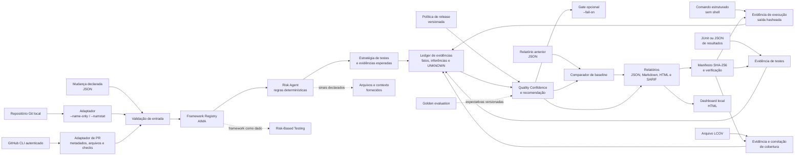
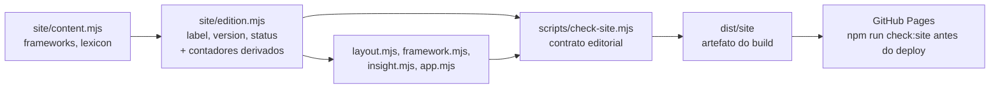

# Arquitetura

O projeto concluiu quatro fatias verticais (MVP 0 a MVP 3) e avança no MVP 4, sem se apresentar como plataforma completa. O CLI coordena módulos determinísticos para entrada declarada, diff Git local ou PR autorizado; coleta evidências locais explícitas; aplica registry, risco e estratégia; e gera relatórios auditáveis.

## Visão de execução

O adaptador de Git lê a lista local de arquivos alterados e, opcionalmente, estatísticas de linhas entre referências. O adaptador de PR usa o GitHub CLI autenticado apenas para metadados, nomes de arquivos e checks disponíveis. O diagrama não implica leitura de conteúdo de diff, uso de LLM, execução automática de comandos não declarados ou publicação automática de comentários.

## Decisões

| Decisão | Motivo | Limite atual |
| --- | --- | --- |
| Node.js sem dependências | Execução simples e reprodutível | Não há parser YAML completo; os arquivos usam subconjunto JSON compatível. |
| Framework Registry | Evita hardcode de metodologias AIMA e seleciona pela superfície declarada | A seleção atual usa sinais de caminho simples. |
| Sinais de risco explícitos | Evita alegações de análise mágica ou leitura remota | Não substitui análise de diff real. |
| Quality Confidence explicável | Mostra trade-offs e incertezas | Métrica experimental, não preditiva. |
| Ledger de evidências | Torna origem e tipo de cada afirmação auditáveis | Registra resultado e hash; não prova que o ambiente externo representa produção. |
| Política de release | Separa governança de decisão e código | Exige contexto humano para impacto e complexidade. |
| Comparação com baseline | Destaca mudanças entre análises declaradas | Não demonstra regressão de código. |
| Evidência estruturada com SHA-256 | Registra integridade de comandos, artefatos e transcripts locais | Não comprova que a execução representa produção. |
| Importadores JUnit, JSON e LCOV | Reúne resultados e cobertura sem logs sensíveis | Parsers deliberadamente limitados aos contratos documentados. |
| Manifesto de evidências | Reproduz uma análise com entradas explícitas | Não descobre nem executa ferramentas automaticamente. |
| Gate opcional de CI | Converte recomendação em código de saída | Padrão não bloqueia pipelines. |
| Manifesto de relatório | Permite verificar integridade dos artefatos gerados | Não comprova veracidade da entrada. |
| Avaliação golden | Detecta regressão em decisões determinísticas | Cobertura limitada aos cenários versionados. |
| Dashboard local | Agrega relatórios para leitura visual | Não persiste dados nem consulta remoto. |
| Adaptador MCP isolado ([`integrations/mcp`](integrations/mcp)) | Expõe o core a clientes MCP sem acoplar o pacote raiz ao SDK | Somente leitura: resources do registry e a tool `analyze_change`, todos sob `assertOperationPermitted`. Ver [ADR 0002](docs/adr/0002-adaptador-mcp-stdio-isolado.md). |
| Core browser-portable (`analyzeChange`) | Permite executar a mesma análise no navegador sem servidor, bundler ou framework | Só `change-input-core.js`, `framework-selection.js`, `risk-engine.js`, `strategy.js`, `report.js`, `evidence-ledger.js` e `analyze-change.js` são portáveis; carregamento de arquivo, escrita e HTTP continuam fora do core, nos adapters. |
| Metadata editorial da Preview Edition (`site/edition.mjs`) | Mantém versão, nome e status da edição pública independentes da versão técnica de `package.json`, com contadores de frameworks/conceitos/diagramas derivados de `site/content.mjs` | Só pode depender de `site/content.mjs`; representações estáticas no `<head>` e no corpo (badge maiúsculo, `aria-label`) são deliberadas e validadas contra a fonte por `scripts/check-site.mjs`, não eliminadas. |

A evolução em andamento concentra-se em integrações autorizadas de escrita, sempre sob revisão humana. Qualquer nova integração deve manter leitura mínima, escrita sempre autorizada e incertezas explícitas.

### Core e adapters

`src/` é a fonte canônica de todo o motor determinístico, incluindo o subconjunto browser-portable. Três adapters chamam o mesmo core sem duplicar regra de negócio: o adapter Node (`analyzeDeclaredChange`, usado pela CLI e pela interface local), o adapter MCP (`integrations/mcp`) e o adapter Browser (`site/analyze.mjs`, via `analyzeChange`). `dist/site` é artefato gerado por `npm run build:site`, nunca versionado (ver `.gitignore`): o script copia os módulos puros de `src/` para `dist/site/core/` e gera `dist/site/generated/aima-data.mjs` a partir de `aima/frameworks/**` e `aima/policies/evidence-aware-release.json`, usando os mesmos loaders (`loadFrameworkRegistry`, `loadReleasePolicy`) que o adapter Node já usa — sem manter uma segunda cópia manual dos dados. `site/` nunca deve reimplementar risco, framework, estratégia, ledger ou decisão de release; só pode consumir o core copiado no build.

### Metadata editorial da Preview Edition

`package.json.version` é a versão técnica do pacote; `site/edition.mjs` é a versão editorial da Preview Edition publicada no site. As duas são independentes: mudar uma não altera nem exige mudar a outra. `edition.mjs` só pode depender de `site/content.mjs` — não importa `package.json`, nenhuma API do Node (`node:fs`, `node:fs/promises` etc.) nem qualquer outra fonte externa de versão, e a mesma regra de fronteira da seção anterior se aplica a ele: é dado editorial do site, não parte do core determinístico.

`edition.mjs` declara `label`, `version` e `status`; deriva `frameworksCount`, `conceptsCount` e `diagramsCount` de `site/content.mjs`, sem duplicar esses números manualmente. `site/layout.mjs`, `site/framework.mjs` e `site/insight.mjs` consomem `edition.version` diretamente; `site/app.mjs` hidrata, via `textContent`, os atributos `data-edition-label`, `data-edition-version`, `data-edition-frameworks-count`, `data-edition-concepts-count` e `data-edition-diagrams-count` presentes no corpo de `index.html` e `preview.html`.

O HTML nunca depende de JavaScript para mostrar a metadata correta: cada atributo `data-edition-*` já contém o valor atual como texto estático, que a hidratação apenas confirma. O `<head>` de `index.html` e `preview.html` (title, meta description, Open Graph) permanece inteiramente estático para garantir que a metadata esteja disponível diretamente no HTML inicial, sem depender de execução de JavaScript. O badge "PREVIEW EDITION" no corpo também permanece estático, para preservar sua representação em maiúsculo — diferente de `edition.label`, que é `"Preview Edition"`. O `aria-label` do bloco de métricas é um atributo HTML, não conteúdo textual de um elemento, e por isso não é alterado por `textContent`; permanece estático pelo mesmo motivo. Essas representações estáticas são deliberadas, não duplicação acidental, e são verificadas contra `edition.mjs` por `scripts/check-site.mjs`, não pelo navegador.

`scripts/check-site.mjs` é o boundary que impede drift entre `edition.mjs` e o resto do site: valida formato e valores de `edition.mjs`, a independência estrutural do seu grafo de imports, os contadores derivados, a metadata do `<head>`, a contagem e o fallback de cada atributo `data-edition-*` dentro do `<body>`, o badge maiúsculo, o `aria-label`, a ausência de versão hardcoded reintroduzida nos consumidores, e a identidade byte-a-byte entre `dist/site/edition.mjs` e a fonte após o build. `npm run check:site` executa o build e todas essas validações numa única chamada; `.github/workflows/pages.yml` roda esse comando antes de publicar — uma inconsistência editorial bloqueia o deploy, não gera apenas aviso.

## Contratos e rastreabilidade

| Elemento | Contrato atual | Referência |
| --- | --- | --- |
| Entrada | Mudança declarada, validada antes da análise | [`aima/schemas/change-input.schema.json`](aima/schemas/change-input.schema.json) |
| Framework | Dados versionados, escolhidos pelo registry | [`aima/frameworks`](aima/frameworks) |
| Decisão | Fatos, inferências e incertezas separados | [`docs/QUALITY_DECISION_MODEL.md`](docs/QUALITY_DECISION_MODEL.md) |
| Evolução | Decisões irreversíveis ou relevantes são registradas | [`docs/adr`](docs/adr) |

## Documentação viva

Documentação e código evoluem no mesmo pull request. Uma alteração de comportamento precisa atualizar, quando aplicável, o contrato de entrada, os testes, o exemplo, o diagrama e o changelog. A convenção detalhada está em [`docs/DOCUMENTATION.md`](docs/DOCUMENTATION.md).
