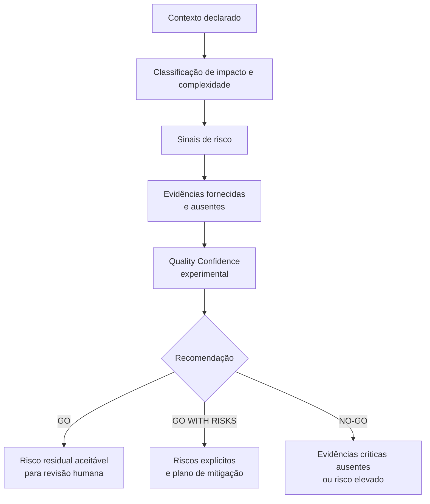
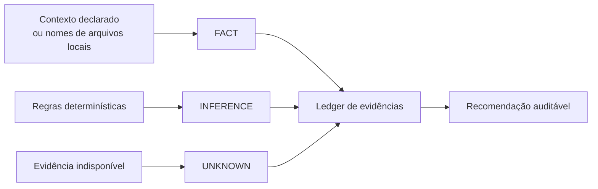

# Modelo de decisão de qualidade

## Objetivo

Transformar uma mudança declarada em uma recomendação de release explicável, sem confundir ausência de evidência com evidência de ausência de risco.

## Tipos de afirmação

| Tipo | Definição | Exemplo no MVP |
| --- | --- | --- |
| Fato | Informação entregue na entrada | `businessImpact: high` |
| Evidência declarada | Resultado relatado por uma pessoa, ainda não verificado pela ferramenta | Suíte de testes executada pelo autor |
| Artefato local | Arquivo de evidência lido localmente e identificado por SHA-256 | Resumo JSON de testes |
| Inferência | Resultado de regra determinística sobre fatos | Arquivo de pagamento gera sinal financeiro |
| Hipótese | Possibilidade ainda não comprovada | Uma alteração pode exigir teste de carga |
| Recomendação | Próxima ação proposta a uma pessoa responsável | Executar teste de carga antes do release |
| `UNKNOWN` | Informação necessária que não está disponível | Resultado de teste de carga não fornecido |

## Ledger de evidências

Cada relatório inclui um ledger versionado e legível por pessoas e ferramentas. Ele associa um identificador, tipo e origem a cada afirmação relevante:

`UNKNOWN` é preservado como tal. Evidências declaradas recebem o estado `declared-not-verified`; artefatos locais recebem `sha256-verified-local-file`, que comprova os bytes lidos, não o resultado alegado. Nenhum dos dois se torna aprovação de release. Uma inferência aponta para os fatos que a sustentam, mas também não se torna prova de execução.

## Limites do score

O **Quality Confidence** é uma visualização de cobertura de evidências e risco declarado. Ele é experimental, não prediz defeitos e não autoriza deploys. Uma recomendação `GO` continua exigindo validação humana e governança do produto.

## Evolução segura

Antes de alterar regras, acrescente ou atualize um cenário em `evals/golden` e teste o resultado esperado. Quando uma regra passar a depender de dados externos, registre a permissão, a origem da evidência e a degradação esperada em caso de indisponibilidade.
