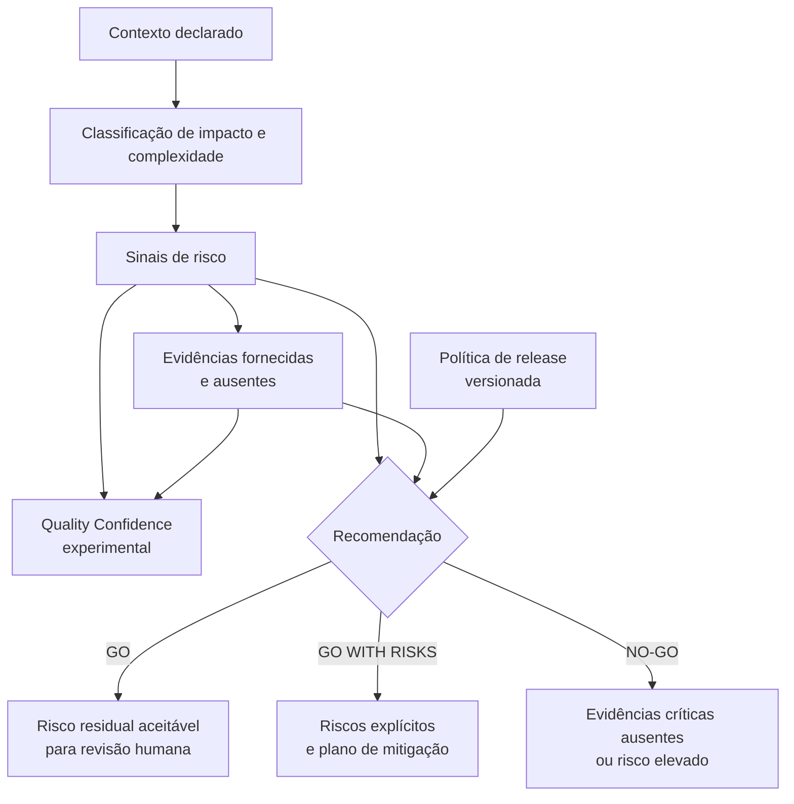
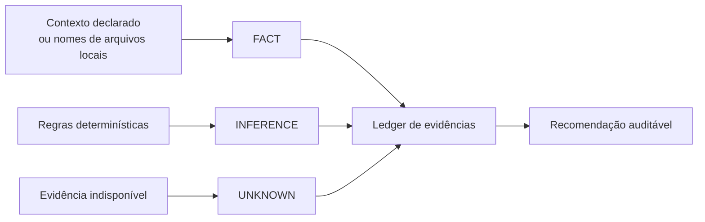

# Modelo de decisão de qualidade

## Objetivo

Transformar uma mudança declarada em uma recomendação de release explicável, sem confundir ausência de evidência com evidência de ausência de risco.

Quality Confidence e a Recomendação de release são calculados **separadamente**, a partir dos mesmos riscos e incertezas, mas nunca um a partir do outro — `buildStrategy()` nunca lê `qualityConfidence.score`. Um relatório sempre mostra os dois números lado a lado, mas eles respondem perguntas diferentes.



## Tipos de afirmação

| Tipo | Definição | Exemplo no MVP |
| --- | --- | --- |
| Fato | Informação entregue na entrada | `businessImpact: high` |
| Evidência declarada | Resultado relatado por uma pessoa, ainda não verificado pela ferramenta | Suíte de testes executada pelo autor |
| Artefato local | Arquivo de evidência lido localmente e identificado por SHA-256 | Resumo JSON de testes |
| Inferência | Resultado de regra determinística sobre fatos | Arquivo de pagamento gera sinal financeiro |
| Hipótese | Possibilidade ainda não comprovada | Uma alteração pode exigir teste de carga |
| Recomendação | Próxima ação proposta a uma pessoa responsável | Executar teste de carga antes do release |
| `UNKNOWN` | Informação necessária que não está disponível | Resultado de teste de carga não fornecido |

## Ledger de evidências

Cada relatório inclui um ledger versionado e legível por pessoas e ferramentas. Ele associa um identificador, tipo e origem a cada afirmação relevante:



`UNKNOWN` é preservado como tal. Evidências declaradas recebem o estado `declared-not-verified`; artefatos locais recebem `sha256-verified-local-file`, que comprova os bytes lidos, não o resultado alegado. Nenhum dos dois se torna aprovação de release. Uma inferência aponta para os fatos que a sustentam, mas também não se torna prova de execução.

## Quality Confidence: modelo, fórmula e limites

**Modelo atual:** `highest-risk-residual-confidence` v`1.0.0` (`qualityConfidence.model` em cada relatório).

O **Quality Confidence** é um indicador residual determinístico baseado no maior risco conhecido e nas incertezas declaradas — não é uma medida de cobertura de evidência positiva. Nenhuma evidência positiva (check de CI aprovado, teste que passou, evidência declarada, cobertura acima do limite) aumenta o score nesta versão: apenas riscos e incertezas o reduzem.

Fórmula:

```
highestRiskScore = max(risk.score para cada risco identificado, ou 0 se não houver risco)
riskPenalty       = min(55, round(highestRiskScore × 0.55))
unknownPenalty    = min(30, unknowns.length × 10)
score             = max(0, 100 - riskPenalty - unknownPenalty)
```

Cada relatório expõe o cálculo completo em `qualityConfidence.calculation` (`highestRiskScore`, `riskPenalty`, `unknownCount`, `unknownPenalty`, `totalPenalty`, `caps`, `rounding`) para que nenhum consumidor precise reimplementar ou adivinhar a fórmula.

- **Escala apresentada:** 0 a 100. Essa é a escala nominal do score, não uma garantia de que qualquer entrada válida alcance os extremos — os caps (`riskPenalty` até 55, `unknownPenalty` até 30) e o piso de risco de uma mudança válida (pelo menos um arquivo alterado) fazem parte do modelo e restringem o intervalo efetivamente alcançável pelo pipeline atual.
- **Não é probabilidade.** Não estima a chance de um defeito ocorrer, não prediz falhas e não é uma métrica científica.
- **Não aprova release.** Uma recomendação `GO` (quando produzida por alguma política) continua exigindo validação humana e governança do produto; o score nunca é lido pela decisão de release (veja o diagrama acima).
- **Trade-off conhecido do modelo `highest-risk-residual-confidence`:** riscos adicionais abaixo do maior risco identificado não reduzem o Quality Confidence nesta versão — o score reage ao pior risco conhecido, não à contagem de riscos. Isso é intencional: um modelo anterior, baseado na média dos riscos, permitia que riscos adicionais (incluindo evidência negativa real, como uma falha de CI ou de cobertura) diluíssem o maior risco e **aumentassem** o score — um defeito confirmado e corrigido nesta versão. O número de riscos identificados continua totalmente visível na lista de riscos do relatório; apenas o score agregado não soma suas contribuições. Uma agregação incremental (ex.: maior risco mais uma contribuição limitada dos demais) poderá ser avaliada no futuro, quando houver um corpus de relatórios reais suficiente para calibrar essa contribuição adicional sem reintroduzir o mesmo problema em outra escala.

## Modelo de versionamento

`qualityConfidence.model.{id,version}` identifica qual fórmula produziu um score. Comparações entre relatórios (baseline, dashboard) só tratam dois scores como comparáveis quando `model.id` e `model.version` são idênticos nos dois lados; um relatório anterior a esta versão, sem `model`, é tratado como o modelo `legacy-unversioned`, distinto de qualquer modelo versionado.

## Evolução segura

Antes de alterar regras, acrescente ou atualize um cenário em `evals/golden` e teste o resultado esperado. Quando uma regra passar a depender de dados externos, registre a permissão, a origem da evidência e a degradação esperada em caso de indisponibilidade.
