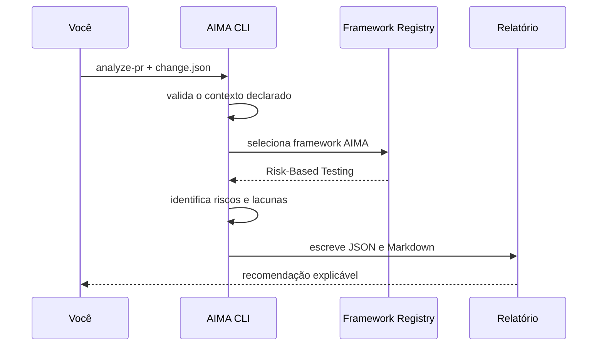

# Guia de uso

Este guia mostra o caminho completo: preparar o ambiente, analisar uma mudança e interpretar o relatório. A execução é local, offline e não envia dados para serviços externos.

## Antes de começar

Você precisa de Node.js 20 ou superior. Confirme a versão:

```bash
node --version
```

Clone o repositório e entre nele:

```bash
git clone https://github.com/jonasqasoftware/aima-agentic-qe.git
cd aima-agentic-qe
```

Não há dependências para instalar no MVP. Execute o teste de integridade antes do primeiro uso:

```bash
npm test
```

## Caminho rápido

Analise o cenário de pagamento incluído no projeto:

```bash
node src/cli.js analyze-pr \
  --change examples/payment-refactor.change.json \
  --out reports
```

O comando imprime uma recomendação e grava três artefatos:

```text
reports/
├── aima-quality-report.json   # integração com ferramentas
├── aima-quality-report.md     # leitura humana e revisão
└── aima-quality-report.html   # painel visual e portátil
```

Abra `aima-quality-report.html` diretamente no navegador para uma leitura visual da recomendação, do score, dos riscos e do ledger de evidências. O arquivo é autocontido: não depende de servidor, biblioteca externa ou transmissão de dados.



## Como criar sua própria análise

Crie, por exemplo, `examples/minha-mudanca.json`:

```json
{
  "id": "PAY-104",
  "summary": "Ajuste de validação no checkout",
  "changedFiles": [
    "src/payments/checkout.js",
    "src/api/orders.js"
  ],
  "businessImpact": "high",
  "technicalComplexity": "medium",
  "knownUnknowns": [
    "Resultado de teste de integração com o gateway não foi fornecido."
  ]
}
```

Em seguida, execute:

```bash
node src/cli.js analyze-pr --change examples/minha-mudanca.json --out reports/pay-104
```

### Campos obrigatórios

| Campo | Tipo | Valores ou regra |
| --- | --- | --- |
| `id` | texto | Identificador legível da mudança |
| `summary` | texto | Resumo objetivo da alteração |
| `changedFiles` | lista | Ao menos um caminho de arquivo declarado |
| `businessImpact` | texto | `low`, `medium` ou `high` |
| `technicalComplexity` | texto | `low`, `medium` ou `high` |
| `knownUnknowns` | lista opcional | Evidências importantes ainda indisponíveis |

O contrato completo está em [`aima/schemas/change-input.schema.json`](../aima/schemas/change-input.schema.json).

## Analisar um diff Git local

Quando já existe um repositório Git local, use `analyze-diff` para criar a lista de arquivos diretamente entre duas referências:

```bash
node src/cli.js analyze-diff \
  --repo /caminho/do/repositorio \
  --base main \
  --head HEAD \
  --impact high \
  --complexity medium \
  --out reports
```

`--impact` e `--complexity` continuam obrigatórios porque representam contexto de produto e implementação que não pode ser inferido apenas pelo Git. Os valores permitidos são `low`, `medium` e `high`.

O adaptador lê **somente os nomes de arquivos** retornados por `git diff --name-only`. O limite de evidência do relatório identifica essa origem; conteúdo do diff, resultado de testes e contexto de produto permanecem `UNKNOWN`. Não há leitura remota do GitHub nem transmissão de dados.

## Como ler a saída

O relatório apresenta quatro camadas que não devem ser confundidas:

| Seção | O que significa | Próxima ação |
| --- | --- | --- |
| Ledger de evidências | Fatos, inferências e `UNKNOWN` com sua origem | Auditar o que fundamenta cada recomendação |
| Riscos | Hipóteses derivadas dos arquivos e contexto declarados | Revisar cenários de maior score |
| Estratégia recomendada | Verificações proporcionais ao risco | Executar ou planejar os testes indicados |
| Evidências ausentes | Dados que a ferramenta não recebeu | Coletar evidência ou assumir explicitamente o risco |
| Recomendação | Sinal de apoio à decisão humana | Revisar antes de aprovar ou liberar |

As recomendações possíveis são:

- **GO:** os riscos declarados e as evidências disponíveis permitem avançar para revisão humana;
- **GO WITH RISKS:** é possível avançar, desde que riscos residuais sejam aceitos e acompanhados;
- **NO-GO:** existe risco elevado ou evidência crítica ausente que pede investigação antes do release.

O valor de **Quality Confidence** é experimental. Ele ajuda a visualizar a combinação de risco e evidência disponível; não é previsão de defeitos e não aprova uma entrega automaticamente. O modelo detalhado está em [QUALITY_DECISION_MODEL.md](QUALITY_DECISION_MODEL.md).

## Solução de problemas

| Mensagem ou sintoma | Causa provável | Como resolver |
| --- | --- | --- |
| `Change input requires...` | Falta `id`, `summary` ou arquivo alterado | Complete os campos obrigatórios do JSON |
| `businessImpact and technicalComplexity...` | Nível de risco inválido | Use somente `low`, `medium` ou `high` |
| Erro de leitura do arquivo | Caminho em `--change` incorreto | Confira o caminho relativo ao diretório atual |
| `No changed files found...` | As referências escolhidas não têm diferença de arquivos | Escolha uma base anterior ou confirme `--head` |
| `Unable to read local Git diff...` | Diretório ou referência Git inválida | Confirme `--repo`, `--base` e `--head` com `git log` |
| Relatório com `UNKNOWN` | Evidência não foi declarada | Colete a evidência ou mantenha o risco explícito |

## Uso no CI

O workflow [`.github/workflows/quality.yml`](../.github/workflows/quality.yml) executa testes e gera o relatório do cenário demonstrativo a cada envio. Uma integração com PR real ainda não existe: ela será adicionada somente com autorização explícita, evidências rastreáveis e tratamento de indisponibilidade.
