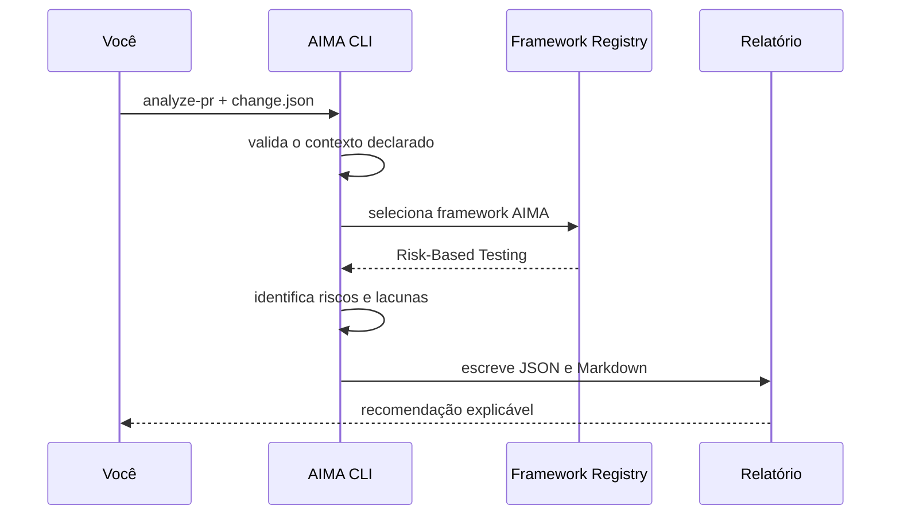

# Guia de uso

Este guia mostra o caminho completo: preparar o ambiente, analisar uma mudança e interpretar o relatório. A execução é local, offline e não envia dados para serviços externos.

## Antes de começar

Você precisa de Node.js 20 ou superior. Confirme a versão:

```bash
node --version
```

Clone o repositório e entre nele:

```bash
git clone https://github.com/jonasqasoftware/aima-agentic-qe.git
cd aima-agentic-qe
```

Não há dependências para instalar no MVP. Execute o teste de integridade antes do primeiro uso:

```bash
npm test
```

## Caminho rápido

Analise o cenário de pagamento incluído no projeto:

```bash
node src/cli.js analyze-pr \
  --change examples/payment-refactor.change.json \
  --out reports
```

### Analisar um Pull Request do GitHub

Depois de autenticar o GitHub CLI, informe o repositório, o número do PR e a classificação humana de impacto e complexidade:

```bash
gh auth login -h github.com --web
node src/cli.js analyze-github-pr \
  --repo jonasqasoftware/aima-agentic-qe \
  --pr 1 \
  --impact medium \
  --complexity medium \
  --out reports
```

O adaptador faz leitura autenticada de metadados, nomes dos arquivos e checks de CI disponíveis pelo GitHub CLI. Ele não lê hunks do diff, não comprova cobertura dos checks, não consulta aprovações e não publica comentários. Checks concluídos são registrados como evidência remota autenticada; uma falha adiciona risco alto. As limitações restantes aparecem como `UNKNOWN` no ledger, portanto a recomendação continua exigindo revisão humana.

### Validar o fluxo completo em uma PR

Uma PR pequena de documentação é suficiente para validar a integração sem simular resultados. Após abrir a PR, substitua o número abaixo pelo valor real e execute:

```bash
node src/cli.js analyze-github-pr \
  --repo jonasqasoftware/aima-agentic-qe \
  --pr 1 \
  --impact low \
  --complexity low \
  --out reports/pr-1
node src/cli.js verify-report --dir reports/pr-1
```

Confirme no relatório HTML (`reports/pr-1/aima-quality-report.html`) que o ledger contém itens `REMOTE_EVIDENCE` para os checks disponíveis. Se nenhum check tiver sido concluído, ou se algum ainda estiver em andamento, isso deve aparecer como `UNKNOWN`; o AIMA não converte ausência de evidência em sucesso. Para compatibilidade com versões estáveis do GitHub CLI, a primeira execução lê até 100 arquivos e 100 checks e declara qualquer possível excedente como `UNKNOWN`.

Por padrão, a recomendação segue [`aima/policies/evidence-aware-release.json`](../aima/policies/evidence-aware-release.json). Para aplicar uma política mais rigorosa, informe `--policy`:

```bash
node src/cli.js analyze-pr \
  --change examples/payment-refactor.change.json \
  --policy examples/strict-release-policy.json \
  --out reports
```

A política rigorosa bloqueia qualquer mudança que possua evidência marcada como ausente. O relatório registra o identificador e a versão da política utilizada.

O framework é selecionado pelo registry: arquivos com `migration`, `schema`, `database` ou `data` acionam **Data Quality Validation**; os demais usam **Risk-Based Testing**. O exemplo [`examples/data-migration.change.json`](../examples/data-migration.change.json) demonstra esse caminho.

### Comparar com uma baseline

Use um `aima-quality-report.json` anterior como baseline para destacar riscos novos, resolvidos e mudanças de score:

```bash
node src/cli.js analyze-pr \
  --change examples/payment-refactor.change.json \
  --baseline reports-anteriores/aima-quality-report.json \
  --out reports-atual
```

A comparação é entre **relatórios declarados**. Ela não prova regressão no código nem substitui execução de testes; essa limitação aparece no próprio relatório.

### Anexar um artefato local de evidência

Você pode anexar um resumo JSON de teste local. O AIMA lê o arquivo e registra seu SHA-256 no ledger:

```bash
node src/cli.js analyze-pr \
  --change examples/payment-refactor.change.json \
  --evidence-artifact examples/unit-test-summary.json \
  --out reports
```

O artefato precisa conter `id`, `type`, `summary` e `status` (`passed`, `failed` ou `unknown`). O hash prova exatamente qual arquivo local foi lido; ele **não** prova que o resultado declarado de teste é verdadeiro, nem altera automaticamente score ou recomendação.

### Executar uma evidência local autorizada

Use um arquivo de especificação para executar um comando local explicitamente autorizado. O AIMA nunca usa shell; por isso, argumentos e execução ficam separados:

```bash
node src/cli.js analyze-pr \
  --change examples/payment-refactor.change.json \
  --execute-evidence examples/node-test.command.json \
  --out reports
```

```json
{
  "id": "NODE-TEST",
  "command": "node",
  "args": ["--test"]
}
```

O executor limita cada comando a 60 segundos e 1 MiB de saída. Ele não inclui logs brutos no relatório: registra status, código de saída, comando, argumentos e hash SHA-256 do transcript. Uma falha é uma evidência verificável e cria risco alto; um sucesso não comprova cobertura, qualidade nem aprovação de release.

### Importar resultado JUnit/XML

Quando a ferramenta de testes gerar JUnit XML, importe-o sem expor o conteúdo das mensagens de falha:

```bash
node src/cli.js analyze-pr \
  --change examples/payment-refactor.change.json \
  --junit examples/test-results.junit.xml \
  --out reports
```

O parser compatível com o subconjunto JUnit registra número total, falhas, ignorados e até 20 casos que falharam. Cada resultado é identificado pelo hash SHA-256 do arquivo. Falhas geram risco alto; um XML vazio ou sem casos é tratado como resultado `unknown`. Cobertura, mensagens de erro e logs continuam fora do relatório por privacidade e porque não comprovam qualidade por si só.

### Importar resultado JSON normalizado

Para ferramentas sem JUnit, use um documento com `tests`, cada item contendo `suite` opcional, `name` e `status` (`passed`, `failed` ou `skipped`):

```bash
node src/cli.js analyze-pr \
  --change examples/payment-refactor.change.json \
  --test-results examples/test-results.json \
  --out reports
```

O JSON segue o mesmo contrato de evidência do JUnit: hash do arquivo, totais, até 20 falhas identificadas e nenhum log bruto incluído.

### Anexar cobertura LCOV

Importe um arquivo `lcov.info` para registrar cobertura de linhas sem ler o código-fonte:

```bash
node src/cli.js analyze-pr \
  --change examples/payment-refactor.change.json \
  --lcov examples/coverage.lcov \
  --min-line-coverage 85 \
  --out reports
```

O limite é opcional. Sem `--min-line-coverage`, a cobertura é somente evidência e não cria risco por si só. Com um limite explícito, uma cobertura abaixo dele cria risco médio ou alto conforme a diferença. O AIMA também correlaciona os arquivos de código alterados com os caminhos do LCOV: registros ausentes criam risco alto, e arquivos abaixo do limite são destacados. Documentação e arquivos sem extensão de código conhecida não entram na correlação. O relatório armazena métricas agregadas e hash do LCOV, não logs nem conteúdo do código.

### Usar manifesto de evidências

Um manifesto único pode declarar comando, JUnit, JSON e LCOV:

```bash
node src/cli.js analyze-pr --change examples/payment-refactor.change.json \
  --evidence-manifest examples/evidence-manifest.json --out reports
```

Os caminhos são resolvidos relativos ao manifesto. O comando é executado sem shell; resultados e cobertura são incorporados ao mesmo ledger.

### Usar como quality gate no CI

Por padrão, a CLI sempre conclui com sucesso depois de gerar os relatórios. Para fazer o processo falhar conforme a recomendação, use `--fail-on`:

```bash
# Falha somente quando a recomendação for NO-GO.
node src/cli.js analyze-pr \
  --change examples/payment-refactor.change.json \
  --fail-on no-go \
  --out reports
```

| Modo | Quando o processo retorna código diferente de zero |
| --- | --- |
| `never` | Nunca; é o padrão e preserva o comportamento informativo |
| `no-go` | Apenas em `NO-GO` |
| `go-with-risks` | Em qualquer recomendação diferente de `GO` |

Os relatórios são gravados antes da falha do gate, mantendo evidências disponíveis para investigação. O workflow padrão do projeto permanece informativo e não usa `--fail-on`.

No GitHub Actions, abra **Actions → Quality gates → Run workflow** para executar manualmente e escolher `never`, `no-go` ou `go-with-risks`. Em `push` e pull request o modo permanece `never`; em todos os casos, o artefato do relatório é enviado mesmo quando o gate falhar.

O comando imprime uma recomendação e grava três artefatos:

```text
reports/
├── aima-quality-report.json   # integração com ferramentas
├── aima-quality-report.md     # leitura humana e revisão
├── aima-quality-report.html   # painel visual e portátil
├── aima-quality-report.sarif  # interoperabilidade com ferramentas de análise
└── aima-quality-report.manifest.json # integridade dos arquivos gerados
```

Abra `aima-quality-report.html` diretamente no navegador para uma leitura visual da recomendação, do score, dos riscos e do ledger de evidências. O arquivo é autocontido: não depende de servidor, biblioteca externa ou transmissão de dados.

O arquivo `aima-quality-report.sarif` usa o padrão SARIF 2.1.0. Seus achados apontam para a superfície de arquivos declarada, sempre na linha 1, pois o MVP não lê o conteúdo do diff. Ele pode ser armazenado como artefato ou entregue a uma integração compatível; o workflow atual **não** envia resultados ao GitHub Code Scanning.

O pacote também inclui `aima-quality-report.manifest.json`, com hash SHA-256 e tamanho de cada relatório. Para verificar se os arquivos continuam idênticos aos gerados:

```bash
node src/cli.js verify-report --dir reports
```

O comando retorna código diferente de zero se algum arquivo estiver ausente ou alterado. O manifesto confirma integridade do pacote, não a veracidade do contexto ou dos resultados de teste.

### Executar avaliações golden

O projeto mantém expectativas conhecidas para evitar regressão das regras determinísticas. Execute todas as validações com:

```bash
npm run check
```

Ou rode a avaliação golden de pagamento isoladamente:

```bash
npm run evaluate
```

Ela compara framework selecionado, categorias de risco, recomendação e presença do limite de evidência com [`evals/golden/payment-refactor.expected.json`](../evals/golden/payment-refactor.expected.json). Um desvio retorna código diferente de zero.

### Criar um dashboard local

Para visualizar vários relatórios já gerados, construa um dashboard HTML autocontido:

```bash
node src/cli.js dashboard \
  --reports /caminho/para/relatorios \
  --out reports/aima-quality-dashboard.html
```

Abra o HTML no navegador. O dashboard mostra quantidade de relatórios, Quality Confidence médio, recomendação, política e número de riscos. Ele percorre somente arquivos locais chamados `aima-quality-report.json` e não transmite dados.



## Como criar sua própria análise

Crie, por exemplo, `examples/minha-mudanca.json`:

```json
{
  "id": "PAY-104",
  "summary": "Ajuste de validação no checkout",
  "changedFiles": [
    "src/payments/checkout.js",
    "src/api/orders.js"
  ],
  "businessImpact": "high",
  "technicalComplexity": "medium",
  "declaredEvidence": [
    {
      "id": "CI-458",
      "type": "integration-test",
      "summary": "Teste de integração executado pelo autor; saída detalhada não anexada.",
      "source": "declared-by-author"
    }
  ],
  "knownUnknowns": [
    "Resultado de teste de integração com o gateway não foi fornecido."
  ]
}
```

Em seguida, execute:

```bash
node src/cli.js analyze-pr --change examples/minha-mudanca.json --out reports/pay-104
```

### Campos obrigatórios

| Campo | Tipo | Valores ou regra |
| --- | --- | --- |
| `id` | texto | Identificador legível da mudança |
| `summary` | texto | Resumo objetivo da alteração |
| `changedFiles` | lista | Ao menos um caminho de arquivo declarado |
| `businessImpact` | texto | `low`, `medium` ou `high` |
| `technicalComplexity` | texto | `low`, `medium` ou `high` |
| `knownUnknowns` | lista opcional | Evidências importantes ainda indisponíveis |
| `declaredEvidence` | lista opcional | Evidências declaradas com `id`, `type`, `summary` e `source` opcional |

O contrato completo está em [`aima/schemas/change-input.schema.json`](../aima/schemas/change-input.schema.json).

Evidências em `declaredEvidence` são registradas no ledger como **declaradas e não verificadas**. Por exemplo, elas podem indicar que alguém executou uma suíte de testes, mas não comprovam o resultado para a ferramenta. O MVP não altera o score nem aprova uma entrega com base nessa declaração.

## Analisar um diff Git local

Quando já existe um repositório Git local, use `analyze-diff` para criar a lista de arquivos diretamente entre duas referências:

```bash
node src/cli.js analyze-diff \
  --repo /caminho/do/repositorio \
  --base main \
  --head HEAD \
  --include-stats \
  --impact high \
  --complexity medium \
  --out reports
```

`--impact` e `--complexity` continuam obrigatórios porque representam contexto de produto e implementação que não pode ser inferido apenas pelo Git. Os valores permitidos são `low`, `medium` e `high`.

Por padrão, o adaptador lê **somente os nomes de arquivos** retornados por `git diff --name-only`. Com `--include-stats`, ele também lê o resultado de `git diff --numstat` e registra linhas adicionadas, removidas e arquivos binários no ledger. Em ambos os casos, conteúdo do diff, resultado de testes e contexto de produto permanecem `UNKNOWN`. Não há leitura remota do GitHub nem transmissão de dados.

## Como ler a saída

O relatório apresenta quatro camadas que não devem ser confundidas:

| Seção | O que significa | Próxima ação |
| --- | --- | --- |
| Ledger de evidências | Fatos, inferências e `UNKNOWN` com sua origem | Auditar o que fundamenta cada recomendação |
| Evidência declarada | Informação fornecida por uma pessoa, ainda não verificada pela ferramenta | Anexar ou coletar resultado verificável se necessário |
| Riscos | Hipóteses derivadas dos arquivos e contexto declarados | Revisar cenários de maior score |
| Estratégia recomendada | Verificações proporcionais ao risco | Executar ou planejar os testes indicados |
| Evidências ausentes | Dados que a ferramenta não recebeu | Coletar evidência ou assumir explicitamente o risco |
| Recomendação | Sinal de apoio à decisão humana | Revisar antes de aprovar ou liberar |

As recomendações possíveis são:

- **GO:** os riscos declarados e as evidências disponíveis permitem avançar para revisão humana;
- **GO WITH RISKS:** é possível avançar, desde que riscos residuais sejam aceitos e acompanhados;
- **NO-GO:** existe risco elevado ou evidência crítica ausente que pede investigação antes do release.

O valor de **Quality Confidence** é experimental. Ele ajuda a visualizar a combinação de risco e evidência disponível; não é previsão de defeitos e não aprova uma entrega automaticamente. O modelo detalhado está em [QUALITY_DECISION_MODEL.md](QUALITY_DECISION_MODEL.md).

## Solução de problemas

| Mensagem ou sintoma | Causa provável | Como resolver |
| --- | --- | --- |
| `Change input requires...` | Falta `id`, `summary` ou arquivo alterado | Complete os campos obrigatórios do JSON |
| `businessImpact and technicalComplexity...` | Nível de risco inválido | Use somente `low`, `medium` ou `high` |
| Erro de leitura do arquivo | Caminho em `--change` incorreto | Confira o caminho relativo ao diretório atual |
| `No changed files found...` | As referências escolhidas não têm diferença de arquivos | Escolha uma base anterior ou confirme `--head` |
| `Unable to read local Git diff...` | Diretório ou referência Git inválida | Confirme `--repo`, `--base` e `--head` com `git log` |
| Relatório com `UNKNOWN` | Evidência não foi declarada | Colete a evidência ou mantenha o risco explícito |

## Uso no CI

O workflow [`.github/workflows/quality.yml`](../.github/workflows/quality.yml) executa testes e gera o relatório do cenário demonstrativo a cada envio. Uma integração com PR real ainda não existe: ela será adicionada somente com autorização explícita, evidências rastreáveis e tratamento de indisponibilidade.
